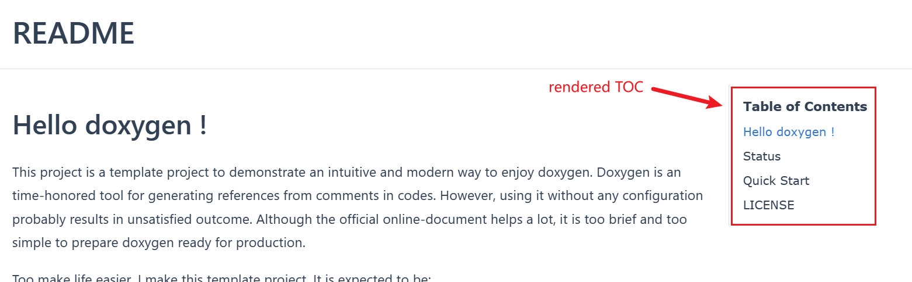

# Use Markdown

[TOC]

Yes, Doxygen can processing `.md` files !! 


## h2

This is `h2` title.


### h3

#### h4

## basic function test

**bold text**

*italic text*

> quote

ordered list test:

1. list 1

2. list 2

3. list 3, nested list test

   1. list 1.a
   2. list 1.b
      1. list 1.b.i
         1. list 1.b.8.alpha
      2. list 1.b.ii
   3. list 1.c

4. list 4, nested block test

   > quote, asdfasdfasdfeeee. Not supported yet. Doxygen treated nested quote blocks as if there were not nested: no indent is added to the left. But common markdown editors, such as typora, correctly render the nested hierarchy and add the indent.

   * hello
   * unordered list


horizontal division

---------------------

code block

```cpp
Student::Student(int name, int address) {
    this->name = name;
    this->address = address;
    this->cls = nullptr;
}
```

```python
import numpy as np
import scipy.signal

def hello(name):
   print(f"hello {name}")

```

## test link

Hyperlinks are complicate compared to other features

See: [link test](../basic-usage/link-test.md)


## image test


To generate HTML with images, put the image folder path in the `Doxyfile` option `IMAGE_PATH`. In this example, the folder path is `use-markdown/typora`. Setting `IMAGE_PATH` manually is tedious, and an `Makefile` is provided to automate it. Command `make docs` will find all images (`*.png` and `*.jpg`) recursively and add their folder paths to `IMAGE_PATH`.

See `Makefile` and `docs/find-img-path.sh` to customize the behavior.


## table test

| hello    | effae  | bdef       |
| -------- | ------ | ---------- |
| alsekjlf | lklkje |            |
| lkke     |        | lkjldkjkfe |
| ---      | --     | dfe        |


## html test

If rendered correctly, there is a red block on the `some text here` and a yellow block on the right.

<div style="display: flex;">
    <div style="display: block; width: 30px; height: 30px; background-color: red;"></div>
    <div>some text here</div>
    <div style="display: block; width: 30px; height: 30px; background-color: yellow;"></div>
</div>


## table of contents

Add `[TOC]` on the line next to the title. Doxygen will generate a TOC sidebar as illustrated bellow.




## article title and Doxygen label

The top level title, defined by `# title`, the `Use Mardown` in this article, will be the label in doxygen. A doxygen label can be referred globally among the project. More specifically, the project comprises all files set by `INPUT` in `Doxyfile`.  Thus this article can be referred as `%\ref Use-Markdown` as an addition to markdown style `[Use Markdown](./markdown-test.md)`. 

If the label is `README`, the article becomes the index page, or welcome page, or main page of the generated web site.

A doxygen label is expected to be **unique** in the project. But there may several markdown files sharing a common name under different sub-folders. In such case, referring markdown by label name breaks down, though doxygen still generate every article. A special exception is that multiple `index` or `mainpage` titled articles confuses doxygen so which article is selected as index page eventually is an undefined behavor.

More about the label of markdown files, refer to official [markdown support](#md_page_header)

Read the section [test link](#test-link) for more examples. 