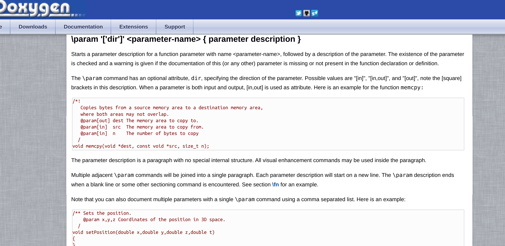

# Use Markdown

Yes, Doxygen can processing `.md` files !!

Bellow are some functional tests.

## h2

### h3

#### h4

## basic

**bold text**

*italic text*

> quote

ordered list test:

1. list 1

2. list 2

3. list 3, nested list test

   1. list 1.a
   2. list 1.b
      1. list 1.b.i
         1. list 1.b.8.alpha
      2. list 1.b.ii
   3. list 1.c

4. list 4, nested block test

   > quote, asdfasdfasdfeeee

   * hello
   * unordered list

horizontal division

---------------------

code block

```cpp
Student::Student(int name, int address) {
    this->name = name;
    this->address = address;
    this->cls = nullptr;
}
```

## test link

See: [link test](../basic-usage/link-test.md)


## image test



支持很差，doxygen 不会自动把图片文件拷贝到输出目录，也不会翻译图片地址，所以生成的网页中不包含图片


## table test

| hello    | effae  | bdef       |
| -------- | ------ | ---------- |
| alsekjlf | lklkje |            |
| lkke     |        | lkjldkjkfe |
| ---      | --     | dfe        |


## html test

<div style="display: flex;">
    <div style="display: block; width: 30px; height: 30px; background-color: red;"></div>
    <div>some text here</div>
    <div style="display: block; width: 30px; height: 30px; background-color: yellow;"></div>
</div>

